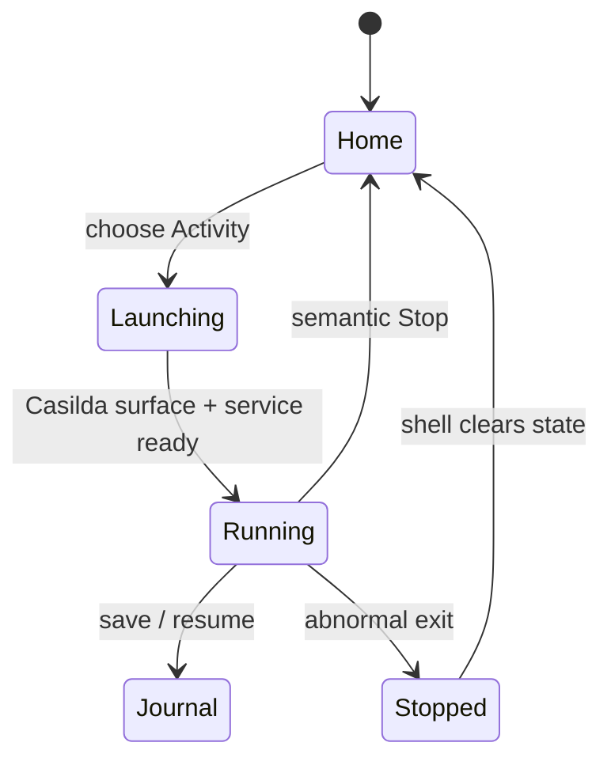
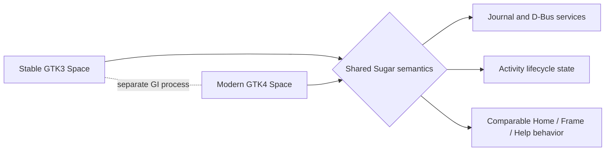

### as-part-a-me

> **A Python-first Arch Linux environment whose desktop is Sugar.**  
> *a sweeter computer*

[](https://github.com/LuckyMonkey/aspartame-linux/stargazers)
[](https://github.com/LuckyMonkey/aspartame-linux/issues)
[](https://github.com/LuckyMonkey/aspartame-linux/commits/master)
[](https://github.com/LuckyMonkey/aspartame-linux/graphs/commit-activity)
[](https://github.com/LuckyMonkey/aspartame-linux)

[](tests/)
[](docs/sugar-modernization/GTK4_RUNBOOK.md)
[](docs/sugar-modernization/GTK4_STATUS.md)

Aspartame is an Arch-derived Linux distribution and a Sugar modernization laboratory. It keeps Sugar's learning-centred model—Home, Activities, Frame, Journal, Neighborhood, Group, palettes, XO identity, and visible context—at the centre of the operating system while retaining practical Linux tools underneath: systemd, pacman, ordinary files, networking, audio, CUPS, SSH, and a real terminal.

This is not a GNOME reskin, and GTK4 is not a redesign of Sugar into a conventional desktop. The goal is to modernize the implementation while preserving the interaction model that makes Sugar distinct.

Aspartame's broader direction is simple: **simple enough for a first-time user, transparent enough for a learner, hackable enough for a developer, and still sitting on Arch underneath.**

## What this is — and is not

| Layer | What it is | What it is **not** |
| --- | --- | --- |
| **Linux** 🐧 | The kernel and low-level platform that talks to hardware | A desktop, distribution, package manager, or Sugar experience |
| **Arch Linux** 🏹 | The upstream distribution foundation: packages, pacman, systemd, conventions, and rolling release | This project's interaction model or a promise that every Arch package is Sugar-aware |
| **Sugar** 🍬 | An activity-centric learning environment and shell vocabulary: Home, Frame, Journal, XO identity, and collaboration | A conventional window manager, a GNOME fork, or merely a theme |
| **Aspartame** 🧬 | A product and integration layer that boots Arch into a Sugar-first system, adds bounded tooling, and carries the GTK4 migration | A replacement Linux kernel, a generic desktop reskin, or upstream Sugar itself |

The distinction matters: **Linux supplies the ground, Arch supplies the materials, Sugar supplies the language, and Aspartame composes them into a reproducible system with its own evidence, policies, and migration work.** A bug in one layer should not be silently attributed to another.

## Why the concepts are unusual

### A Sugar HIG, not a desktop theme

The Human Interface Guidelines here describe relationships and exits, not just colors. A person should know where they are, what owns the current work, how to get back, and what will happen before an action occurs. Large targets, visible focus, attached palettes, XOColor state, and a canonical Stop action make those relationships legible to children and experienced users alike.

The long-term principle is progressive disclosure: the system should remain approachable on first contact without becoming something a user must eventually outgrow.

### Activities, not application windows

An **Activity** is a focused context with a lifecycle and a Journal relationship. Launching creates a known identity; running state is authoritative shell state; stopping clears the process and surface; resuming returns to an object. This is different from opening an arbitrary window and hoping its files remain discoverable.

### Objects, not a hidden file tree

An **Object** is a meaningful piece of work with metadata, an owning Activity, and a resumable history in the Journal. The object boundary supports learning: the user can search by what they did, not only where a file happened to be stored. Persistence is therefore a user-facing concept and a service contract, not an implementation detail.

### Neighborhood, not a contact list

The **Neighborhood** is a contextual view of nearby people, shared work, and available collaboration. It may honestly be empty. It does not invent peers, turn the shell into a social feed, or hide networking failures behind fake content. Presence and shared Activities remain separate from the local Journal.

### Chirality, not generic multitasking

**Chirality** is Aspartame's bounded two-context model. A task may have a Left Hand and a Right Hand, but only one is visible and active at a time. The other holds its state.

> **Two hands. One focus. No third hand.**

It is deliberately **not** split-screen, tiling, arbitrary workspace management, or unlimited window accumulation. The model is: one hand holds steady while the other ratchets. Either hand can become active; either can hold; neither is permanently primary.

During the GTK4 migration, the existing F7/F8 Spaces serve as an executable comparison oracle:

- **F7** — stable GTK3 Sugar, the known-good behavioral reference.
- **F8** — modern GTK4 Sugar, the candidate implementation under test.

The current migration machinery and the future Chirality doctrine are related, but they are not the same thing. F7/F8 remain a GTK3↔GTK4 testing mechanism until the migration gate is satisfied. Only after GTK4 parity is good enough should that proven switching behavior be repurposed as Left Hand / Right Hand.

## 🧭 What is here today

The bootable image starts a real Sugar session. The development VM runs two separate shell spaces for direct comparison:

| Space | Purpose | Boundary |
| --- | --- | --- |
| Classic (F7) | Stable GTK3 Sugar reference | X11 + Metacity |
| Modern (F8) | GTK4 conversion under test | GTK4 shell + Casilda private Wayland Activity surfaces |

GTK3 and GTK4 are separate Python processes and never import both GI namespaces into one process. Journal/datastore and shell services provide the coordination boundary; Casilda owns the embedded Activity surface.

The modern Space has verified native GTK4 shell surfaces for Home Favorites and List views, search, Frame, Journal, Neighborhood/Group empty states, Settings, Help, palettes, clipboard transfer, Activity Manager, and approval prompts. Real Activity processes launch, receive shell lifecycle events, stop, and clear their running state through Casilda.

The migration is intentionally evidence-led. **Runtime coverage is not called behavioral parity.** Every Activity is classified in [ACTIVITY_PORT_CLASSIFICATION.md](docs/sugar-modernization/ACTIVITY_PORT_CLASSIFICATION.md) as one of:

- **FULL PORT** — core workflow, persistence/object behavior, and normal interaction demonstrated against GTK3.
- **FUNCTIONAL PORT** — principal offline workflow is usable, but breadth, collaboration, or parity remains reduced.
- **COVERAGE IMPLEMENTATION** — native GTK4 surface primarily proving registry, rendering, input, lifecycle, or one bounded workflow.
- **PLACEHOLDER** — launchable stub; does not count toward retirement.

That distinction is deliberate protection against false green checks.

## 🖼️ Screenshots

These are captures from the current 1920×1080 QEMU reference session, not mockups:


The Help Activity is a native dark GTK4 surface with searchable expandable English documentation covering the shell, XO identity, Home, Activities, Journal saving/resume, Spaces, Casilda surfaces, Count, accessibility, and troubleshooting. For the Activity Manager and approval prompt, see the [QEMU screenshot gallery](docs/screenshots/README.md).

## 📈 Progress at a glance

Progress bars describe verified repository work, not a claim that the full retirement gate has passed.

| Goal | Status | Verified details |
| --- | --- | --- |
| GTK4 build and CSS validation | <span style="color:#2ea44f"><strong>██████████ 100%</strong></span> | ✅ Preview build<br>🎨 GTK CSS checks<br>🔍 Patch semantics verified |
| Shell surfaces | <span style="color:#2ea44f"><strong>█████████░ 90%</strong></span> | 🏠 Home / Frame / Journal<br>⚙️ Settings / Help / palettes<br>🤝 Honest empty collaboration state |
| Activity lifecycle | <span style="color:#2ea44f"><strong>█████████░ 90%</strong></span> | 🚀 Casilda launch and stop<br>🔁 Repeated normal/abnormal cleanup<br>💡 Running-state reconciliation |
| Activity catalog parity | <span style="color:#2ea44f"><strong>██████░░░░ 60%</strong></span> | ✅ Broad live GTK4 coverage<br>⚠️ Many Activities are FUNCTIONAL PORTs<br>🧩 FULL PORT remains evidence-gated |
| GTK3 ↔ GTK4 Spaces | <span style="color:#2ea44f"><strong>████████░░ 80%</strong></span> | 🧬 Separate processes<br>↔️ Semantic switching<br>⚠️ Physical input transport remains environment-sensitive |
| Collaboration peers | <span style="color:#2ea44f"><strong>███░░░░░░░ 30%</strong></span> | 🌐 Honest empty state<br>👥 Peer-backed actions need a second participant |
| GTK4 retirement gate | <span style="color:#2ea44f"><strong>███████░░░ 70%</strong></span> | 🧾 Evidence ledger<br>🚧 Human parity, physical input, and peer gates remain |

The authoritative checklist is [CONVERSION_TRACKER.md](docs/sugar-modernization/CONVERSION_TRACKER.md), not a screenshot or a passing unit test alone.

## 🧬 Architecture

```text
Arch image
    └─ Sugar session (stable GTK3 or modern GTK4 Space)
         ├─ Home / Frame / Journal / Neighborhood / Settings / Help
         ├─ shell model and D-Bus services
         └─ Casilda
              └─ private Wayland Activity surfaces
                   └─ native GTK4 Activity process
```

The modern shell uses GTK4 layout and input primitives (`GtkBox`, `GtkStack`, `GtkListView`, `GtkPopover`, EventControllers, and Snapshot/GSK where custom drawing is needed). GTK CSS is validated as GTK CSS; browser properties such as flexbox or CSS Grid are not used as layout substitutes. Geometry belongs to GTK layout; styling belongs to supported GTK CSS.

Activity launchers are kept behind a bundle-oriented boundary so native Python Activities, Snakepit-resolved applications, and future web Activities can be resolved independently.

### Python-first, not Python-only

Aspartame's architectural preference is Python wherever Python remains appropriate. Sugar itself is unusually Python-heavy, and that is a feature here rather than an accident. Shell logic, Activities, orchestration, tooling, tests, and future application resolution should remain inspectable and hackable in Python where practical.

The rule is not dogmatic:

> **Python all the way down until continuing to use Python would become stupid.**

GTK, GLib, GObject, Casilda, the compositor, kernel, drivers, codecs, and other native layers remain native where that is the correct abstraction.

### 🌱 Sugar concepts preserved

- Home Favorites and List views, with XOColor and stopped/starting/running/current states.
- Activities as focused workspaces rather than conventional application windows.
- Frame navigation, palettes, contextual actions, and keyboard semantics.
- Journal objects, metadata, search, resume, and datastore service boundaries.
- Neighborhood and Group models, including an honest no-peer empty state.
- Activity Manager policy: user Activities can be uninstalled; package-managed Activities are disabled/hidden rather than falsely claimed to be removed.
- Shell-wide contextual Help and the canonical Sugar stop control.
- Accessibility names, roles, descriptions, visible focus, deterministic Tab order, and predictable escape paths as part of the UI contract rather than an afterthought.

## 🧩 Activity status

The current native GTK4 inventory includes functional implementations for Help, Count, Calculate, Clock, JAMClock, Image Viewer, Terminal, Browse, Log, Read, Write, NumberRush, Poll, Mancala, Reversi, Jumble, Mastermind, BlockParty, PlayGo, Implode, BallAndBrick, Appel Haken, IQ, Across and Down, Maze, Memorize, Words, Portfolio, FotoToon, Finance, Markdown, Stopwatch, TurtleBlocks, Gears, Last One Loses, Grid Paint, Get Things Done, Abacus, Planets, Color My World, Game Of Life, Diamond Fusion, Connect the Dots, Pippy, Typing Turtle, Moon, Paint, Level, Jukebox, and Get Books.

That list is runtime coverage, not a promise of complete upstream feature breadth. Read the classification table for each Activity's workflow and boundary. Sugarizer web catalog entries remain catalog-only until an actual runtime implementation exists.

A major current theme is persistence: Activities are increasingly promoted only after proving a real Journal roundtrip—do work, stop, resume the same object, and visibly recover state. Launch/stop alone is no longer treated as meaningful parity evidence.

## 🧪 How GTK3 ↔ GTK4 testing works

Spaces are not merely two desktops. They are an executable behavioral oracle.

```text
F7 → open known-working GTK3 Activity
   → establish expected behavior

F8 → open corresponding GTK4 Activity
   → repeat the same task

Difference?
   YES → parity gap
   NO  → verified behavior
```

This keeps the stable GTK3 implementation as the executable specification while the GTK4 side matures. Tests, docs, and automated lifecycle checks support this process, but they do not replace human comparison of real workflows.

The important retirement metric is **behavioral parity**, not launch count.

## 🛠️ Build and run

Large archiso caches and VM disks live on the host's SteamLibrary volume so the root filesystem is not filled by image builds.

```sh
git clone https://github.com/LuckyMonkey/aspartame-linux.git
cd aspartame-linux
make test                 # host tests
make iso                  # bootable Arch image
make run                  # QEMU reference VM
```

The generated image is written under `dist/` with a date-stamped filename. The development GTK4 source overlay and pinned checkouts are mounted from the `aspartame-dev` share during preview work; the current ISO documentation does not claim those development sources are embedded.

Useful overrides:

```sh
RAM=8192 CPUS=4 make run
QEMU_WINDOW_WIDTH=1920 QEMU_WINDOW_HEIGHT=1080 make run
```

Inside a running guest:

```sh
scripts/sugar-gtk4-runtime-check.sh gtk3
scripts/sugar-gtk4-runtime-check.sh gtk4
scripts/sugar-gtk4-space.sh status
```

The full preview rebuild, including semantic patch verification, is:

```sh
./scripts/sugar-gtk4-build.sh
```

## 🧪 Verification widgets

Executable checks and durable evidence live together:

| Check | Command/result |
| --- | --- |
| GTK4 regression suite | `pytest -q tests/test_gtk4*` → **271 passed** |
| Guest source/build | `scripts/sugar-gtk4-build.sh` → **PASS** |
| Spaces process check | `scripts/sugar-gtk4-runtime-check.sh gtk3/gtk4` |
| Activity lifecycle | `scripts/sugar-gtk4-activity-roundtrip.py` and `reports/gtk4/` |
| CSS contracts | `tests/test_gtk4_focus_ring.py` and build-time validation |
| Visual proof | `scripts/sugar-screenshot.sh` → 1920×1080 PNG + SHA-256 + OCR |

Runtime logs prove process IDs, selected Space, GTK/Casilda state, Activity service readiness, and cleanup. Screenshots are supplementary evidence, not the sole acceptance criterion.

<details>
<summary>✅ What the green checks mean</summary>

The green indicators are earned by executable tests, a guest build, or a captured runtime probe. They do not mean every upstream Sugar feature has been rewritten. A warning or empty checkbox is intentionally visible so a reader can distinguish **working coverage**, **behavioral parity**, and **future work**.

</details>



## Aspartame Chirality

The full [Aspartame Chirality runbook](docs/sugar-modernization/ASPARTAME_CHIRALITY.md) defines the post-GTK4 interaction doctrine in more detail.

Its core model is intentionally small:

```text
                   ONE TASK
                       │
                    OBJECT
                       │
             ┌─────────┴─────────┐
             │                   │
        LEFT HAND           RIGHT HAND
             │                   │
         Activity              Activity
             │                   │
          HELD ◄──────────────► ACTIVE
```

At any moment:

```text
hands <= 2
visible_activities == 1
active_hands == 1
```

There is no third hand. There is no normal split-screen mode. The operating system may preserve many processes and Activities, but Chirality constrains the immediate working context rather than the whole machine.

Hand identity is intended to inherit the user's XOColor pair. Color reinforces the concept but must never be the sole semantic cue; position, labels, focus treatment, and accessibility metadata remain required.




The illustration is a mnemonic, not a proposed window layout. The shared bridge is deliberately narrow. It carries identities, models, and service contracts—not toolkit widgets, global focus, or accidental GTK compatibility state.

## Sugar HIG and bounded interaction

Aspartame follows a Sugar-shaped HIG rather than importing GNOME, Material, or web conventions:

- One focused workspace at a time; Home and Frame preserve orientation.
- Large, readable targets with visible focus and keyboard equivalents.
- XOColor communicates identity and semantic state, never decoration alone.
- Palettes and popovers stay attached to their target and dismiss predictably.
- Stop is always a clear Sugar stop action; destructive changes request explicit approval.
- Journal objects are the user's history, not an incidental file browser.
- Empty collaboration states explain the absence of peers instead of inventing data.
- Accessibility names, roles, descriptions, deterministic Tab order, and no focus traps are part of the UI contract.
- GTK geometry belongs to GTK layout managers; CSS supplies appearance only.
- Transitions animate pixels inside an owned surface, never fragile native-window choreography.

“Bounded” means a feature has a clear owner, state model, input contract, and exit path. It does not mean small or underpowered. A bounded Activity can grow later without forcing the shell to guess whether a process is running, whether a Journal object was saved, or which window owns focus.

For child-first interaction, important actions should be discoverable without depending entirely on text. Iconography, focus state, spoken names, reversible actions, and semantic input all reinforce the same underlying operation.

## Approval-required system actions

System-level Activity Manager operations use a Sugar-native approval surface. The prompt is fullscreen, black, minimal, and separate from the old GNOME Polkit/GTK dialog. It says **approval requested**, accepts a confirmation word (including `yes`, `yeah`, `yeet`, `sure`, `okay`, `confirm`, `please`, `affirmative`, `approve`, `accept`, `go`, and `granted`), and accepts Enter. Words beginning with `n` cancel immediately. A single pill-shaped Stop + Cancel control remains below the form, with the canonical Sugar stop sign also present in the top bar.

The prompt authorizes the action; it does not reveal or bypass an administrator password. Activity Manager distinguishes user-installed bundles, which can be uninstalled, from package-managed bundles, which are disabled or hidden rather than falsely reported as deleted. Journal entries remain preserved unless the user explicitly requests otherwise.


## 🧰 Snakepit and application resolution

Aspartame is designed to become broader than a fixed bundle list without contaminating Arch's system Python. **Snakepit** is the planned Python application resolver: a reverse package chooser that can select suitable interpreters, isolated environments, ABI/platform constraints, GUI bindings, and application stacks without pretending there is only one Python version on the machine.

Conceptually:

```text
application request
      │
      ▼
  Snakepit
      │
      ├─ interpreter compatibility
      ├─ package / ABI requirements
      ├─ GTK / Qt / Tk / media / scientific stack
      └─ isolated environment
      │
      ▼
launchable application
```

The goal is not to turn the base OS into a pip environment. The system Python remains system-owned; application environments stay isolated. Activity Manager can later unify traditional Sugar Activities with Snakepit-backed applications behind one truthful lifecycle model.

## 🐕‍🦺 Pets — preserved, not pursued

The [Pets runbook](docs/planned/ASPARTAME_PETS_RUNBOOK.md) is intentionally a **deferred design document**, not a current roadmap commitment.

The idea is an optional accessibility-oriented guide that can fetch information, find or explain objects, help with lightweight organization, and return useful results to the Journal. It is explicitly **not** a generic chatbot, Copilot, autonomous desktop operator, provider-owned memory system, or requirement for ordinary Aspartame use.

The proposal is intentionally parked until three conditions are substantially true:

1. capable AI is openly available and free to use in this role without making Aspartame dependent on a proprietary subscription or vendor;
2. the capability can reasonably operate offline, so inference can be treated as ordinary computer infrastructure rather than a mandatory external service; and
3. assumptions, preconceptions, implicit biases, and stigma around “AI” have settled enough that the feature can be evaluated for what it actually does instead of being automatically understood as a chatbot, surveillance mechanism, or autonomous agent.

If revisited, the rule is that **Aspartame owns memory, retrieval, authority, provenance, and task state; inference remains replaceable.** The durable product of assistance should be a normal Sugar object, not a hidden provider conversation.

> **Pets should become possible because inference became boring, not because AI became fashionable.**

## 📚 Runbooks and project guides

The README is intentionally the front door. The runbooks hold the strict contracts, evidence rules, and migration details.

### Start here

- [GTK4 modernization index](docs/sugar-modernization/README.md)
- [Complete documentation index](docs/README.md)
- [Current GTK4 status](docs/sugar-modernization/GTK4_STATUS.md)
- [Conversion tracker and retirement gate](docs/sugar-modernization/CONVERSION_TRACKER.md)
- [Activity classifications](docs/sugar-modernization/ACTIVITY_PORT_CLASSIFICATION.md)

### Runtime and migration

- [GTK4 runtime runbook](docs/sugar-modernization/GTK4_RUNBOOK.md)
- [Activity lifecycle runbook](docs/sugar-modernization/GTK4_ACTIVITY_RUNBOOK.md)
- [Journal runbook](docs/sugar-modernization/GTK4_JOURNAL_RUNBOOK.md)
- [GTK4 debugging](docs/sugar-modernization/GTK4_DEBUGGING.md)
- [Architecture compatibility](docs/sugar-modernization/ARCH_COMPATIBILITY.md)
- [Aspartame Chirality steering runbook](docs/sugar-modernization/ASPARTAME_CHIRALITY.md)

### Project and visual references

- [QEMU screenshot gallery](docs/screenshots/README.md)
- [General Sugar development](docs/SUGAR-DEVELOPMENT.md)
- [Build instructions](docs/building.md)
- [Known issues](docs/known-issues.md)

### Design-desk runbooks

- [Count Activity runbook](docs/runbooks/COUNT_ACTIVITY_RUNBOOK.md)
- [Universal Help runbook](docs/runbooks/UNIVERSAL_HELP_RUNBOOK.md)
- [Scale Activity runbook](docs/runbooks/SCALE_ACTIVITY_RUNBOOK.md)
- [Pets runbook — deferred future concept](docs/planned/ASPARTAME_PETS_RUNBOOK.md)

Before changing migration code, read the status, tracker, classification table, and Chirality runbook. They define ownership, evidence boundaries, patch policy, and the distinction between a useful coverage implementation and a real port.

## 🚧 Current open work

The project is intentionally still in conversion. The highest-value remaining items are:

1. **Human GTK3↔GTK4 parity qualification** — use F7/F8 as the executable oracle and exercise real workflows, not only lifecycle probes.
2. **Physical input proof** — continue proving keyboard delivery through the actual QEMU/evdev path while keeping semantic shell actions separate from transport.
3. **Peer-backed collaboration** — exercise Neighborhood/Group behavior with a second real participant.
4. **Activity promotion** — move Activities from COVERAGE IMPLEMENTATION → FUNCTIONAL PORT → FULL PORT only when GTK3 behavior, persistence, input, accessibility, and user-visible state justify it.
5. **Self-contained packaging** — embed the modernized sources and pinned Activity set into a release image when the development overlay is ready to graduate.
6. **Migration cleanup** — once parity is strong enough, delete dead compatibility scaffolding instead of carrying the migration forever.

These are tracked gaps, not silent fallbacks. GTK3 remains the healthy behavioral and visual reference until the gate is genuinely satisfied.

---

### Project direction

Aspartame is still earning the right to become something larger than a Sugar modernization effort. The critical path remains:

```text
GTK4 Sugar
   ↓
accessible Sugar
   ↓
modern Activities
   ↓
Snakepit integration
   ↓
Aspartame-specific services and interaction ideas
   ↓
a distinct Python-first operating environment
```

The point is not to replace Sugar's ideas with modern desktop conventions. It is to preserve the parts that were unusually good, modernize the implementation underneath them, and only then start extending the model.
