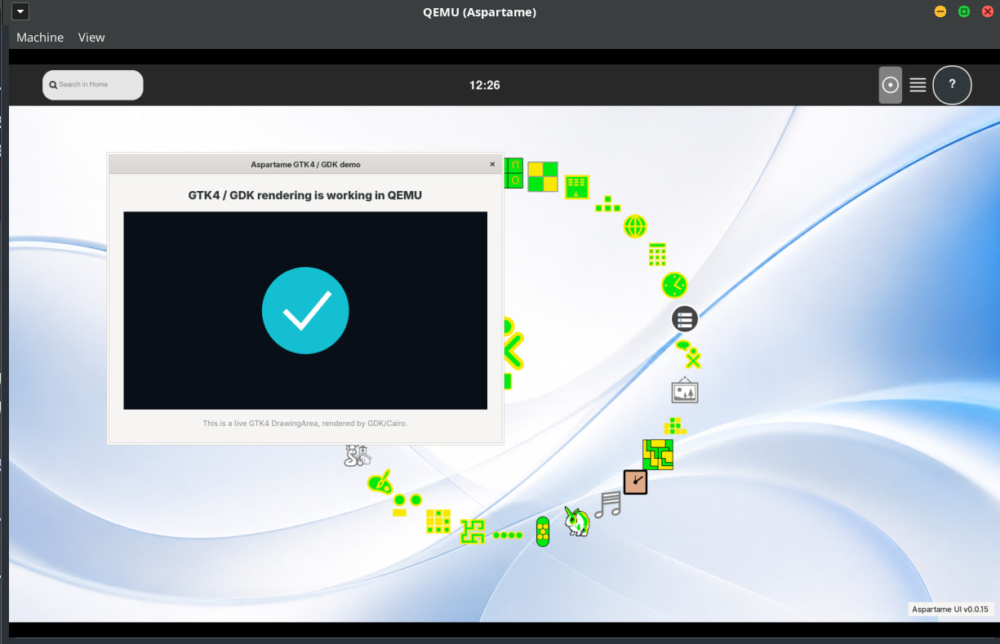
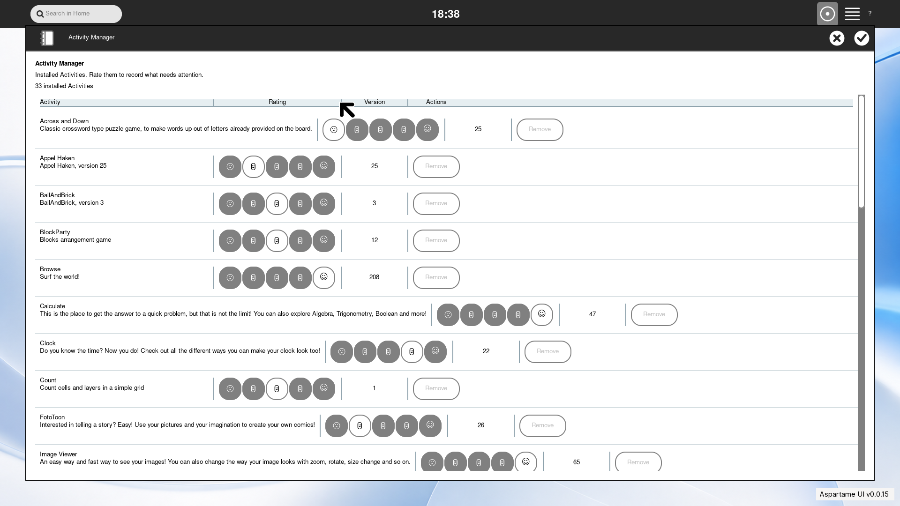
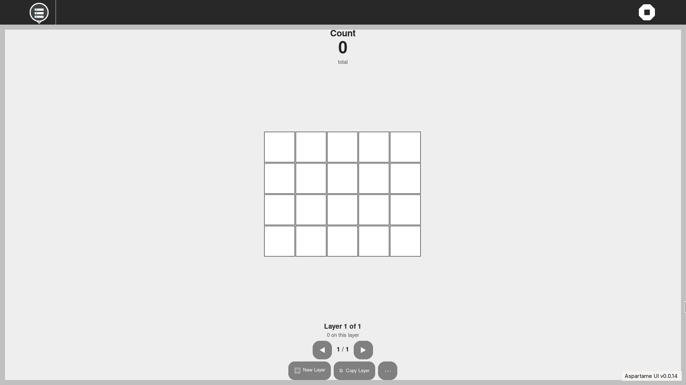

# Aspartame

## GTK4 First Pixels milestone

The isolated GTK4 preview has produced its first genuine Sugar-rendered
pixels in QEMU. This is an early rendering checkpoint; the stable GTK3
desktop remains the production path while the GTK4 shell continues to develop.




**Sugar on Arch.**
Aspartame is an Arch-derived desktop distribution with Sugar as its primary
interaction model. It preserves Home, Activities, Journal, Frame, Group,
Neighborhood, palettes, and Sugar's color/state semantics while building a
modern general-purpose system around them.

The current bootstrap is a reproducible archiso image that boots directly into
a real Sugar session in QEMU. It includes networking, browser and Terminal
Activities, persistent user data, audio infrastructure, CUPS, SSH-based
development control, and a 1920×1080 reference display.

## Quick start

Large archiso caches and artifacts live on SteamLibrary rather than the Ubuntu
root filesystem.

```sh
git clone https://github.com/LuckyMonkey/aspartame-linux.git
cd aspartame-linux
make test
make iso
make run
```

Override QEMU defaults with environment variables:

```sh
RAM=8192 CPUS=4 make run
```

## Screenshots

The current QEMU reference session:






See the [QEMU VM screenshot gallery](docs/screenshots/README.md) for captions,
capture details, and the complete representative set.

## Sugar development

The repository now has one deterministic Sugar development loop:

```sh
make sugar-info
# Edit sugar-overlay/src/jarabe/...
make sugar-reload
make sugar-logs
make sugar-screenshot
```

Use `make sugar-session-restart` only for the broader tty1/X/session boundary.
The runtime/source/process map and recovery procedure are in
[docs/SUGAR-DEVELOPMENT.md](docs/SUGAR-DEVELOPMENT.md). Styling layers are
mapped in [docs/SUGAR-STYLING.md](docs/SUGAR-STYLING.md).

## Architecture

Aspartame keeps Arch, pacman, systemd, ordinary filesystem paths, and a real
terminal beneath Sugar. Python is preferred for understandable user-layer
integration; Arch's system Python and low-level native infrastructure remain
distribution-owned. CUPS is intentional core infrastructure.

Start with:

- [architecture](docs/architecture.md)
- [building](docs/building.md)
- [QEMU](docs/qemu.md)
- [Sugar current state](docs/sugar-current-state.md)
- [Sugar development](docs/SUGAR-DEVELOPMENT.md)
- [Sugar styling](docs/SUGAR-STYLING.md)
- [Sugar GTK4 modernization](docs/sugar-modernization/README.md)
- [known issues](docs/known-issues.md)

The durable engineering backlog is in [TODO.md](TODO.md).

The live image's autologin and root development password are for QEMU
engineering only and are not an installed-system security model.
