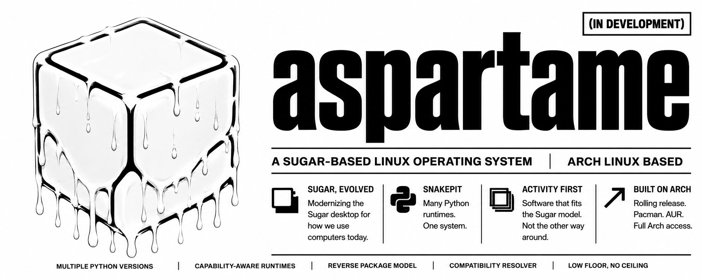
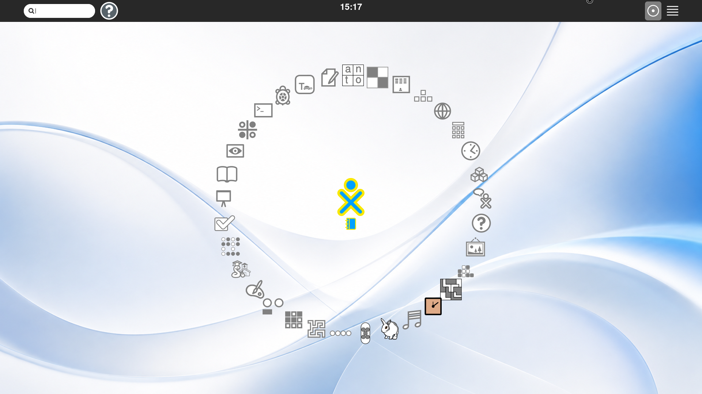
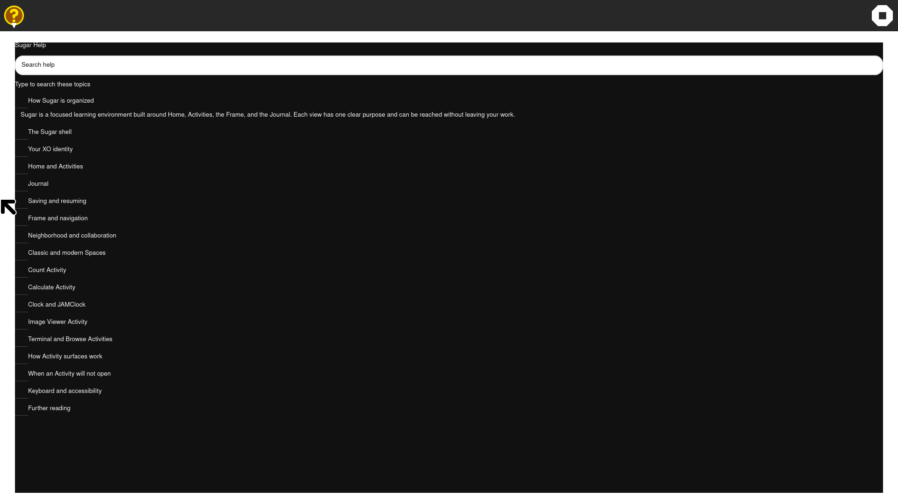
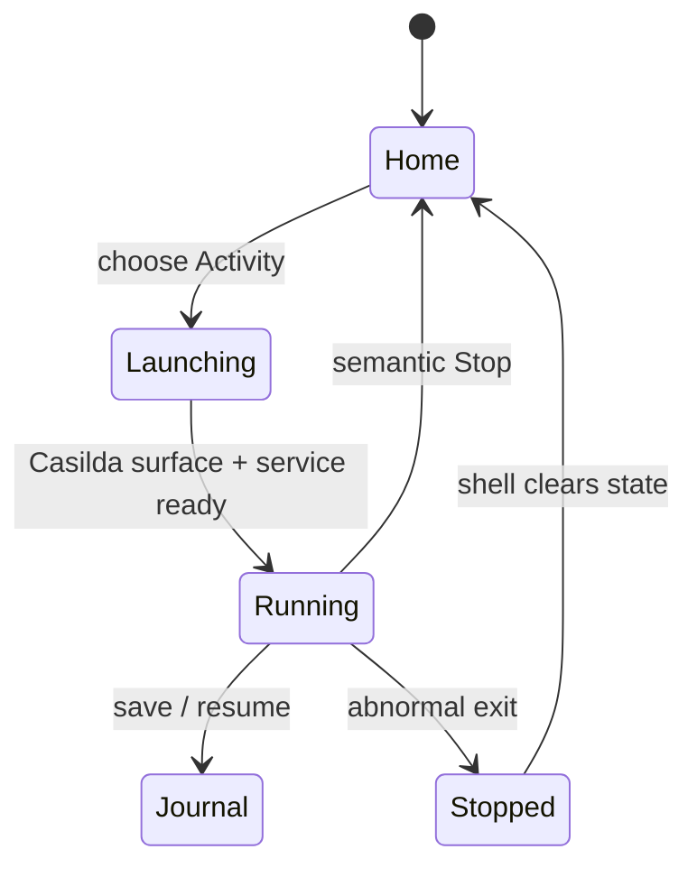
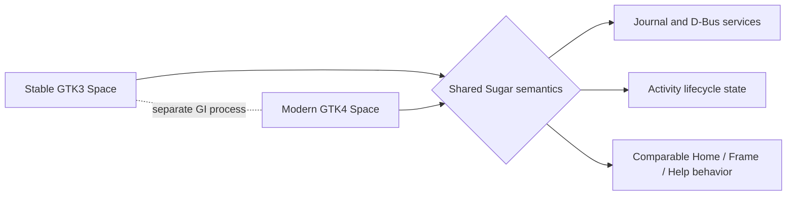
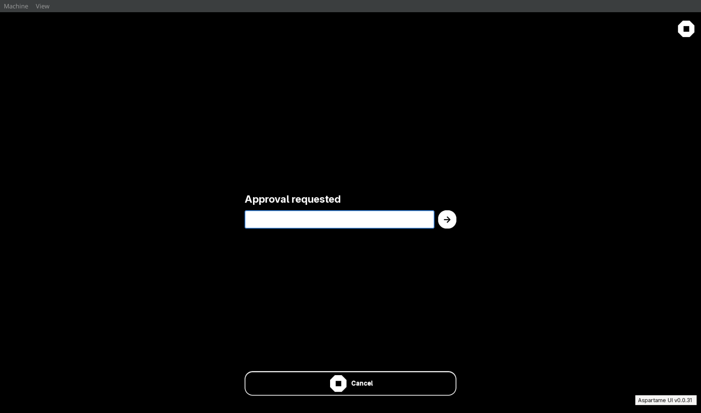

### as-part-a-me

> A Python-first Arch Linux environment whose desktop is Sugar.

[](https://github.com/LuckyMonkey/aspartame-linux/stargazers)
[](https://github.com/LuckyMonkey/aspartame-linux/issues)
[](https://github.com/LuckyMonkey/aspartame-linux/commits/master)
[](https://github.com/LuckyMonkey/aspartame-linux/graphs/commit-activity)
[](https://github.com/LuckyMonkey/aspartame-linux)

[](tests/)
[](docs/sugar-modernization/GTK4_RUNBOOK.md)
[](docs/sugar-modernization/GTK4_STATUS.md)

This project is an Arch-derived Linux distribution and a Sugar modernization
laboratory. It keeps Sugar's learning-centred model—Home, Activities, Frame,
Journal, Neighborhood, Group, palettes, XO identity, and visible context—at
the centre of the operating system while retaining practical Linux tools
underneath: systemd, pacman, ordinary files, networking, audio, CUPS, SSH, and
a real terminal.

This is not a GNOME reskin. GTK4 is an implementation modernization of Sugar,
not a change to Sugar's interaction model.

## 🧭 What is here today:

The bootable image starts a real Sugar session. The development VM runs two
separate shell spaces for direct comparison:

| Space | Purpose | Boundary |
| --- | --- | --- |
| Classic (F7) | Stable GTK3 Sugar reference | X11 + Metacity |
| Modern (F8) | GTK4 conversion under test | GTK4 shell + Casilda private Wayland Activity surfaces |

GTK3 and GTK4 are separate Python processes and never import both GI
namespaces into one process. Journal/datastore and shell services provide the
coordination boundary; Casilda owns the embedded Activity surface.

The modern Space has verified native GTK4 shell surfaces for Home Favorites
and List views, search, Frame, Journal, Neighborhood/Group empty states,
Settings, Help, palettes, clipboard transfer, Activity Manager, and approval
prompts. Real Activity processes launch, receive shell lifecycle events, stop,
and clear their running state through Casilda.

Runtime coverage is deliberately not called behavioral parity. Every Activity
is classified in [ACTIVITY_PORT_CLASSIFICATION.md](docs/sugar-modernization/ACTIVITY_PORT_CLASSIFICATION.md)
as FULL PORT, FUNCTIONAL PORT, COVERAGE IMPLEMENTATION, or PLACEHOLDER.

## 🖼️ Screenshots:

These are captures from the current 1920×1080 QEMU reference session, not
mockups:





The Help Activity is a native dark GTK4 surface with searchable expandable
English documentation covering the shell, XO identity, Home, Activities,
Journal saving/resume, Spaces, Casilda surfaces, Count, accessibility, and
troubleshooting. For the Activity Manager and approval prompt, see the
[QEMU screenshot gallery](docs/screenshots/README.md).

## 📈 Progress at a glance:

Progress bars describe verified repository work, not a claim that the full
retirement gate has passed.

| Goal | Status | Verified details |
| --- | --- | --- |
| GTK4 build and CSS validation | <span style="color:#2ea44f"><strong>██████████ 100%</strong></span> | ✅ Preview build<br>🎨 GTK CSS checks<br>🔍 Patch semantics verified |
| Shell surfaces | <span style="color:#2ea44f"><strong>█████████░ 90%</strong></span> | 🏠 Home / Frame / Journal<br>⚙️ Settings / Help / palettes<br>🤝 Honest empty collaboration state |
| Activity lifecycle | <span style="color:#2ea44f"><strong>█████████░ 90%</strong></span> | 🚀 Casilda launch and stop<br>🔁 Repeated normal/abnormal cleanup<br>💡 Running-state reconciliation |
| Activity catalog parity | <span style="color:#2ea44f"><strong>██████░░░░ 60%</strong></span> | ✅ 49 live coverage implementations<br>⚠️ Most are FUNCTIONAL PORTs<br>🧩 No FULL PORT claim yet |
| GTK3 ↔ GTK4 Spaces | <span style="color:#2ea44f"><strong>████████░░ 80%</strong></span> | 🧬 Separate processes<br>↔️ Semantic switching<br>⚠️ Physical F-key transport remains environment-sensitive |
| Collaboration peers | <span style="color:#2ea44f"><strong>███░░░░░░░ 30%</strong></span> | 🌐 Empty state<br>👥 Peer-backed actions need a second participant |
| GTK4 retirement gate | <span style="color:#2ea44f"><strong>███████░░░ 70%</strong></span> | 🧾 Evidence ledger<br>🚧 Physical input and peer gates remain |

The authoritative checklist is [CONVERSION_TRACKER.md](docs/sugar-modernization/CONVERSION_TRACKER.md),
not a screenshot or a passing unit test alone.

## 🧬 Architecture:

```text
Arch image
    └─ Sugar session (stable GTK3 or modern GTK4 Space)
         ├─ Home / Frame / Journal / Neighborhood / Settings / Help
         ├─ shell model and D-Bus services
         └─ Casilda
              └─ private Wayland Activity surfaces
                   └─ native GTK4 Activity process
```

The modern shell uses GTK4 layout and input primitives (`GtkBox`, `GtkStack`,
`GtkListView`, `GtkPopover`, EventControllers, and Snapshot/GSK where custom
drawing is needed). GTK CSS is validated as GTK CSS; browser properties such as
flexbox or CSS Grid are not used as layout substitutes. Activity launchers are
kept behind a bundle-oriented boundary so native Python, Snakepit, and future
web Activities can be resolved independently.

### 🌱 Sugar concepts preserved:

- Home Favorites and List views, with XOColor and stopped/starting/running/current states.
- Activities as focused workspaces rather than conventional application windows.
- Frame navigation, palettes, contextual actions, and keyboard semantics.
- Journal objects, metadata, search, resume, and datastore service boundaries.
- Neighborhood and Group models, including an honest no-peer empty state.
- Activity Manager policy: user Activities can be uninstalled; package-managed
  Activities are disabled/hidden rather than falsely claimed to be removed.
- Shell-wide contextual Help and the canonical Sugar stop control.

## 🧩 Activity status:

The current native GTK4 inventory includes functional implementations for
Help, Count, Calculate, Clock, JAMClock, Image Viewer, Terminal, Browse, Log,
Read, Write, NumberRush, Poll, Mancala, Reversi, Jumble, Mastermind,
BlockParty, PlayGo, Implode, BallAndBrick, Appel Haken, IQ, Across and Down,
Maze, Memorize, Words, Portfolio, FotoToon, Finance, Markdown, Stopwatch,
TurtleBlocks, Gears, Last One Loses, Grid Paint, Get Things Done, Abacus,
Planets, Color My World, Game Of Life, Diamond Fusion, Connect the Dots, Pippy,
Typing Turtle, Moon, Paint, Level, Jukebox, and Get Books.

That list is runtime coverage, not a promise of complete upstream feature
breadth. Read the classification table for each Activity's workflow and
boundary. Sugarizer web catalog entries remain catalog-only until an actual
runtime implementation exists.

## 🛠️ Build and run:

Large archiso caches and VM disks live on the host's SteamLibrary volume so the
root filesystem is not filled by image builds.

```sh
git clone https://github.com/LuckyMonkey/aspartame-linux.git
cd aspartame-linux
make test                 # host tests
make iso                  # bootable Arch image
make run                  # QEMU reference VM
```

The generated image is written under `dist/` with a date-stamped filename. The
development GTK4 source overlay and pinned checkouts are mounted from the
`aspartame-dev` share during preview work; the current ISO documentation does
not claim those development sources are embedded.

Useful overrides:

```sh
RAM=8192 CPUS=4 make run
QEMU_WINDOW_WIDTH=1920 QEMU_WINDOW_HEIGHT=1080 make run
```

Inside a running guest:

```sh
scripts/sugar-gtk4-runtime-check.sh gtk3
scripts/sugar-gtk4-runtime-check.sh gtk4
scripts/sugar-gtk4-space.sh status
```

The full preview rebuild, including semantic patch verification, is:

```sh
./scripts/sugar-gtk4-build.sh
```

## 🧪 Verification widgets:

Executable checks and durable evidence live together:

| Check | Command/result |
| --- | --- |
| GTK4 regression suite | `pytest -q tests/test_gtk4*` → **271 passed** |
| Guest source/build | `scripts/sugar-gtk4-build.sh` → **PASS** |
| Spaces process check | `scripts/sugar-gtk4-runtime-check.sh gtk3/gtk4` |
| Activity lifecycle | `scripts/sugar-gtk4-activity-roundtrip.py` and `reports/gtk4/` |
| CSS contracts | `tests/test_gtk4_focus_ring.py` and build-time validation |
| Visual proof | `scripts/sugar-screenshot.sh` → 1920×1080 PNG + SHA-256 + OCR |

Runtime logs prove process IDs, selected Space, GTK/Casilda state, Activity
service readiness, and cleanup. Screenshots are supplementary evidence, not
the sole acceptance criterion.

<details>
<summary>✅ What the green checks mean</summary>

The green indicators are earned by executable tests, a guest build, or a
captured runtime probe. They do not mean every upstream Sugar feature has been
rewritten. A warning or empty checkbox is intentionally visible so a reader
can distinguish **working coverage**, **behavioral parity**, and **future work**.

</details>



## 📚 Runbooks and project guides:

- [GTK4 modernization index](docs/sugar-modernization/README.md)
- [Current GTK4 status](docs/sugar-modernization/GTK4_STATUS.md)
- [Conversion tracker and gate](docs/sugar-modernization/CONVERSION_TRACKER.md)
- [Activity classifications](docs/sugar-modernization/ACTIVITY_PORT_CLASSIFICATION.md)
- [GTK4 runtime runbook](docs/sugar-modernization/GTK4_RUNBOOK.md)
- [Activity lifecycle runbook](docs/sugar-modernization/GTK4_ACTIVITY_RUNBOOK.md)
- [Journal runbook](docs/sugar-modernization/GTK4_JOURNAL_RUNBOOK.md)
- [GTK4 debugging](docs/sugar-modernization/GTK4_DEBUGGING.md)
- [Architecture compatibility](docs/sugar-modernization/ARCH_COMPATIBILITY.md)
- [Aspartame Chirality steering runbook](docs/sugar-modernization/ASPARTAME_CHIRALITY.md)
- [QEMU screenshot gallery](docs/screenshots/README.md)
- [General Sugar development](docs/SUGAR-DEVELOPMENT.md)
- [Build instructions](docs/building.md)
- [Known issues](docs/known-issues.md)

Before changing migration code, read the status, tracker, and Chirality
runbook. They define ownership, evidence boundaries, patch policy, and the
distinction between a useful coverage implementation and a real port.

Additional planning runbooks from the design desk are preserved in the
repository:

- [Count Activity runbook](docs/runbooks/COUNT_ACTIVITY_RUNBOOK.md)
- [Universal Help runbook](docs/runbooks/UNIVERSAL_HELP_RUNBOOK.md)
- [Scale Activity runbook](docs/runbooks/SCALE_ACTIVITY_RUNBOOK.md)
- [Pets runbook — planned/maybe/future](docs/planned/ASPARTAME_PETS_RUNBOOK.md)

The Pets document is intentionally filed as a future idea only. It is not an
implementation commitment and has not been expanded here.

## Aspartame Chirality

Chirality is the project's steering metaphor: two surfaces can share an
identity and purpose while remaining distinct implementations. In practice,
Aspartame has a stable left hand (GTK3 Sugar) and a modern right hand (GTK4
Sugar). They are comparable, but they are not mixed. Each hand must remain
coherent on its own before the pair can replace the old model.

This metaphor produces concrete engineering rules:

| Chirality principle | Aspartame rule |
| --- | --- |
| Same shape, separate orientation | Preserve Sugar semantics while using GTK4-native layout, input, and rendering APIs |
| A mirror is not a duplicate | Share models and service contracts, not GTK widgets or GI namespaces |
| Compare corresponding surfaces | Use F7/F8 Spaces to compare Home, Frame, Journal, and Activities side by side |
| Handedness has an owner | Label every workaround as Aspartame, Sugar, toolkit, Activity, Casilda, GTK, packaging, or harness-owned |
| Do not hide an asymmetry | Record missing peers, physical-input limits, and reduced Activity breadth explicitly |
| Rotation must preserve identity | XOColor, Activity IDs, Journal objects, and lifecycle state remain stable across Spaces |

Chirality also explains why bounds matter. Sugar is an educational environment,
not a collection of unrelated windows. A panel, palette, Activity, and Journal
entry each have a meaningful relationship to the user's current context. A
new feature is accepted when it strengthens that relationship; it is deferred
when it introduces a generic desktop metaphor, an invisible fallback, or a
second source of truth. This is why the conversion favors native GTK4
primitives, bounded Activity workflows, and evidence-led promotion from
COVERAGE IMPLEMENTATION to FUNCTIONAL PORT or FULL PORT.

Read the complete [Aspartame Chirality runbook](docs/sugar-modernization/ASPARTAME_CHIRALITY.md)
for the longer design language, ownership boundaries, transition rules,
activity surfaces, and acceptance philosophy.




The illustration is a mnemonic, not a proposed window layout: **two hands,
one purpose, no namespace collision**. The shared bridge is deliberately
narrow. It carries identities, models, and service contracts—not toolkit
widgets, global focus, or accidental GTK compatibility state.

## Sugar HIG and bounded interaction:

Aspartame follows a Sugar-shaped HIG rather than importing GNOME, Material, or
web conventions:

- One focused workspace at a time; Home and Frame preserve orientation.
- Large, readable targets with visible focus and keyboard equivalents.
- XOColor communicates identity and semantic state, never decoration alone.
- Palettes and popovers stay attached to their target and dismiss predictably.
- Stop is always a clear Sugar stop action; destructive changes request explicit approval.
- Journal objects are the user's history, not an incidental file browser.
- Empty collaboration states explain the absence of peers instead of inventing data.
- Accessibility names, roles, descriptions, and deterministic Tab order are part of the UI.
- GTK geometry belongs to GTK layout managers; CSS supplies appearance only.
- Transitions animate pixels inside an owned surface, never fragile native-window choreography.

“Bounded” means a feature has a clear owner, state model, input contract, and
exit path. It does not mean small or underpowered. A bounded Activity can grow
later without forcing the shell to guess whether a process is running, whether
a Journal object was saved, or which window owns focus.

## Approval-required system actions:

System-level Activity Manager operations use a Sugar-native approval surface.
The prompt is fullscreen, black, minimal, and separate from the old GNOME
Polkit/GTK dialog. It says **approval requested**, accepts a confirmation word
(including `yes`, `yeah`, `yeet`, `sure`, `okay`, `confirm`, `please`,
`affirmative`, `approve`, `accept`, `go`, and `granted`), and accepts Enter.
Words beginning with `n` cancel immediately. A single pill-shaped Stop + Cancel
control remains below the form, with the canonical Sugar stop sign also present
in the top bar.

The prompt authorizes the action; it does not reveal or bypass an administrator
password. Activity Manager distinguishes user-installed bundles, which can be
uninstalled, from package-managed bundles, which are disabled or hidden rather
than falsely reported as deleted. Journal entries remain preserved unless the
user explicitly requests otherwise.



## 🚧 Current open work:

The project is intentionally still in conversion. The highest-value remaining
items are:

1. Prove and improve physical keyboard delivery in the actual QEMU/evdev path;
   semantic shell actions are separate from transport proof.
2. Exercise peer-backed Neighborhood/Group actions with a second participant.
3. Promote individual Activities from FUNCTIONAL PORT toward FULL PORT only
   when their GTK3 behavior, persistence, input, and accessibility are
   independently demonstrated.
4. Package the development overlay and pinned Activity sources into a
   self-contained release image when that packaging work is ready.

These are tracked gaps, not silent fallbacks. GTK3 remains the healthy
behavioral and visual reference until the gate is genuinely satisfied.
