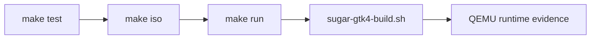

# Building

> **Status:** current build entry point · **Goal:** reproducible image +
> inspectable GTK4 preview 🛠️

Build from an Arch Linux environment with `archiso` installed:

```sh
make iso
make test
```

`out/` contains generated images and `work/` contains archiso working data;
neither is committed. This Ubuntu workstation does not currently have
`mkarchiso`, so the repository reports that prerequisite clearly instead of
silently using a non-Arch substitute.

## Visual build target


A successful development image reaches a real Sugar Home session in QEMU.
## Build contract:

The host build produces a bootable Arch image; the guest preview build applies
and validates the GTK4 overlay against pinned source checkouts. These are
related but distinct artifacts. A passing host test does not prove a guest
surface is mapped, and a screenshot does not prove lifecycle cleanup.



## Evidence checklist:

- ✅ host tests pass;
- ✅ patch/CSS validation passes in the guest;
- 🔎 runtime logs identify the shell, Space, Activity PID, and Casilda state;
- 🖼️ screenshots are captured at the reference resolution;
- 🧹 stop and abnormal-exit probes leave no orphan process or stale icon.

