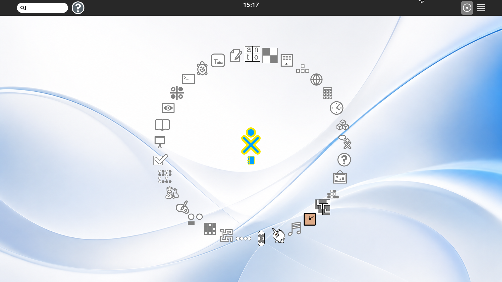

# 🌐 Networking:

> **Status:** current platform notes; collaboration claims require live peers

NetworkManager is the system authority in the bootstrap image. Avahi and
`nss-mdns` provide passive DNS-SD/mDNS discovery. Neighborhood 2.0 should
expose discovered services as objects and actions, not require protocol URLs.

The Sugar desktop toolbar now provides an explicit `Scan network` action. It
derives the active guest IPv4 subnet and runs `nmap -sn -T3` with a 45-second
limit, presenting results in a dialog. It never scans automatically. In the
QEMU reference setup this discovers the private `10.0.2.0/24` user-mode NAT
network; bridged networking will be needed to discover the physical LAN.
Active scanning must remain an explicit action on unknown, corporate, hotel,
or public networks. VPN is a
future Sugar view with backend-neutral support for WireGuard, NetworkManager
VPN plugins, OpenVPN, and optionally Tailscale.
## Sugar boundary:

NetworkManager and the kernel own connectivity. Neighborhood consumes a
contextual peer model and must report an honest empty state when no peers are
available. A connected network is not, by itself, proof of collaboration.

The repeatable headless QEMU peer fixture uses a second socket-backed NIC with
explicit static addresses and distinct MACs for each guest. The 2026-10-04
qualification used `10.77.0.1/24` and `10.77.0.2/24`, started the existing
Avahi daemon, and verified `_presence._tcp` records before claiming peer
presence. `scripts/run-qemu.sh` accepts `QEMU_EXTRA_NIC_MAC` to prevent cloned
fixtures from silently sharing a layer-2 identity.

Before starting the GTK4 shell in each cloned guest, run
`scripts/sugar-gtk4-peer-prepare.sh a` or `... b` as root. It assigns the
private NIC, gives Avahi/Salut a distinct hostname, and creates a fresh
profile environment under `/run/aspartame-peer-{a,b}.env`. Source that file as
the `aspartame` user before launching `scripts/sugar-gtk4-run.sh`; the runner
accepts `ASPARTAME_SUGAR_HOME`, `ASPARTAME_SUGAR_PROFILE`, and
`ASPARTAME_SUGAR_PROFILE_NAME` without changing the normal single-guest
profile. This prevents cloned owner keys and stale presence records from being
mistaken for a GTK4 join failure.

