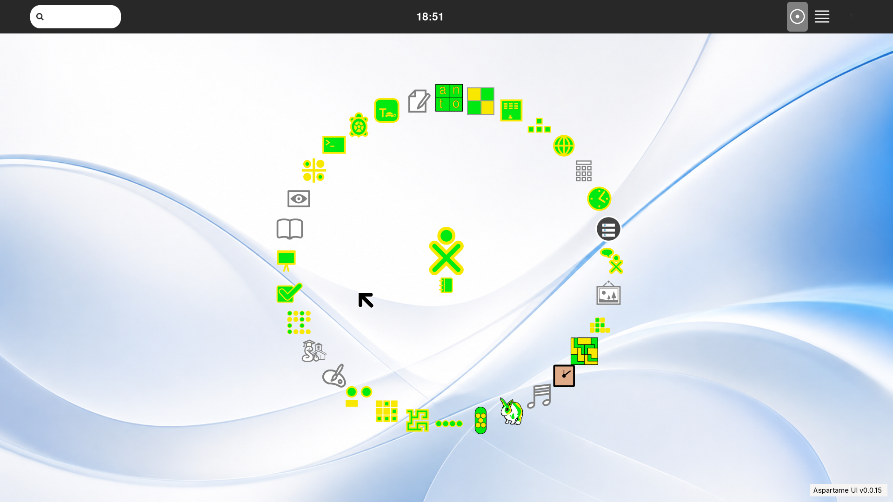

# QEMU reference machine

```sh
make iso
RAM=4096 CPUS=4 make run
```

The runner selects KVM with `-cpu host` when `/dev/kvm` is usable and falls
back to multithreaded TCG otherwise. Defaults are q35, four GiB RAM, four CPUs,
virtio disks/network/GPU, 1920×1080 GTK display, USB tablet, AC97, and a serial
log. Override `RAM`, `CPUS`, `ISO`, `DISK`, `DATA_DISK`, `DEV_SHARE`, or
`AUDIO_BACKEND` in the environment.

The equivalent command is generated directly by `scripts/run-qemu.sh`; no
virt-manager state is involved. The key arguments are:

```text
qemu-system-x86_64
  -enable-kvm -cpu host -machine q35 -m 4096 -smp 4
  -drive file=.../aspartame-test.qcow2,if=virtio,format=qcow2
  -drive file=.../aspartame-data.qcow2,if=virtio,format=qcow2
  -cdrom .../aspartame-YYYY.MM.DD-x86_64.iso
  -device virtio-vga,xres=1920,yres=1080
  -display gtk,gl=off,zoom-to-fit=on
  -nic user,model=virtio-net-pci,hostfwd=tcp:127.0.0.1:2222-:22
  -virtfs local,path=.../aspartame-dev,mount_tag=aspartame-dev,security_model=none
  -device qemu-xhci -device usb-tablet
```

## Reference VM appearance



The repository's [screenshot gallery](screenshots/README.md) records the Activity Manager and Count views as well.

## Development control

SSH is forwarded only on host loopback:

```sh
./scripts/ssh-asp
make sugar-info
make sugar-reload
make sugar-logs
make sugar-screenshot
```

The development share is mounted at `/mnt/aspartame-dev`. The repository is the
editing authority; the share is generated by `make sugar-reload`. Do not edit
the mounted runtime directly. Current 9p ownership requires one host `sudo`
prompt during reload; writes are scoped to the runtime share.

`make sugar-reload` keeps Xorg running but replaces the supervised Sugar D-Bus
island, shell, and Metacity. `make sugar-session-restart` is the broader tty1/X
restart. Exact boundaries and recovery are documented in
[SUGAR-DEVELOPMENT.md](SUGAR-DEVELOPMENT.md).

`make sugar-screenshot` captures guest X11 directly with ffmpeg and transfers
the image over SSH. It does not call a host screenshot utility or interfere
with host keyboard shortcuts.

## Persistence contract

`aspartame-data.qcow2` is the persistent home volume. The guest formats it only
when it has no filesystem, mounts it at `/home/aspartame`, and refuses to start
Sugar if that exact `/dev/vdb` mount is absent. Journal, dconf, favorites,
layout, browser data, and user files therefore survive shell, session, and QEMU
restarts.

The live root and `aspartame-test.qcow2` are separate from this user-data disk.
Do not replace `DATA_DISK` unless a deliberately fresh Aspartame profile is
wanted.
