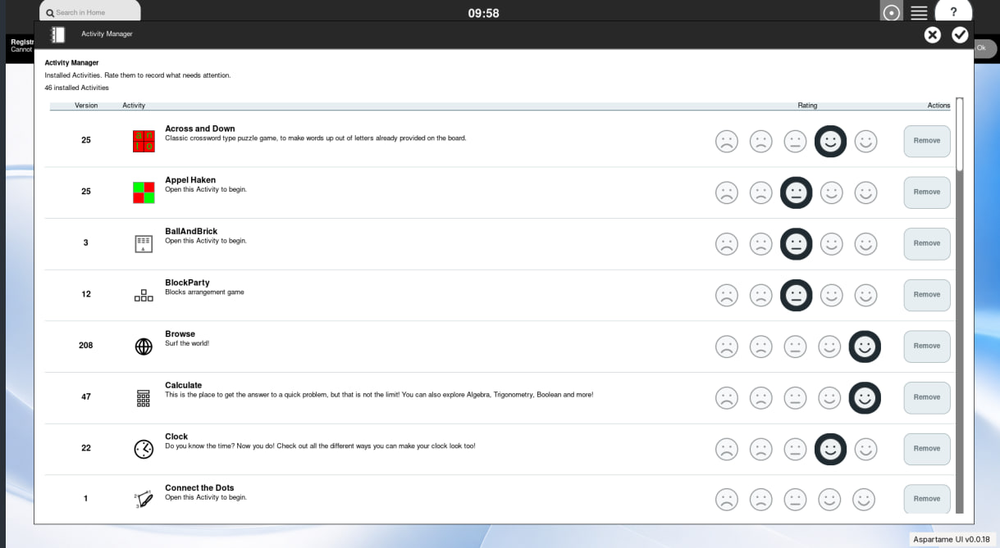
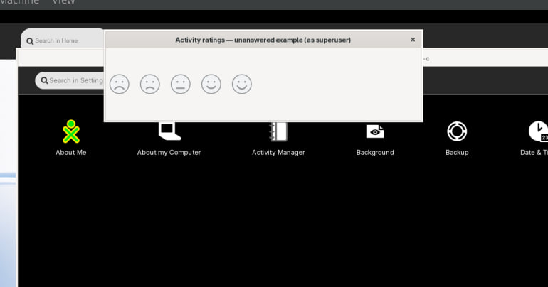
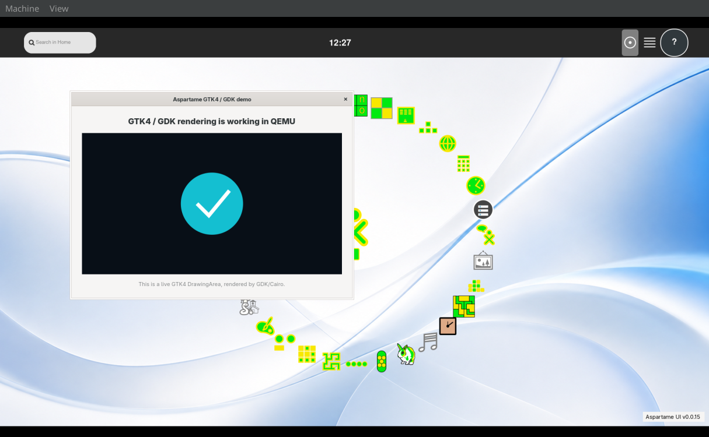

# Aspartame VM screenshots

These images are captured from the QEMU reference VM at 1920x1080 using ./scripts/sugar-screenshot.sh. They document the visible bootstrap state without using the host screenshot hotkey.

## Current views

### Sugar Home

The Sugar Home view with the XO-centered Activity layout and Aspartame shell chrome.

### Activity Manager
The Settings → Activity Manager view showing installed Activities and the five-level rating column.

The fixed-column Activity Manager layout keeps activity identity, metadata,
ratings, and removal actions aligned.

The reusable five-face control starts with no answer selected and records one
chosen review rating when the user selects a face.

### Count

The Count Activity prototype showing its current counting surface.

### GTK4 First Pixels GTK4 / GDK QEMU demo

The isolated GTK4 Sugar preview reached its first recognizable Sugar-rendered pixels.

A live GTK4 DrawingArea and GDK/Cairo rendering demo running inside QEMU.

The images are reference snapshots, not authoritative UI tests; runtime verification remains in reports/ and the Sugar development workflow.
