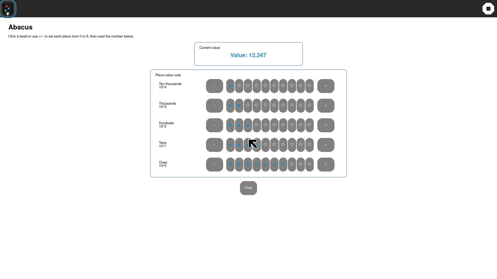

# Abacus GTK4 UX qualification — 2026-10-05

The synchronized development guest was used to exercise the current native
Abacus Activity. The probe restored a five-rod Journal object, activated the
seventh Ones bead through AT-SPI, observed the value change from `12,345` to
`12,347`, and stopped the Activity cleanly.

```text
cycle=1 ... resume=PASS service-release=PASS shell-cleanup=PASS
abacus-roundtrip=PASS direct-bead-action=PASS input-method=AT-SPI datastore-payload=seeded
```

The capture shows the intended bounded workspace: a readable current-value
card, a centered framed place-value rod surface, direct bead controls, and a
single Clear action. This is development-share evidence, not a claim of full
upstream Abacus feature parity or GTK3 retirement.


