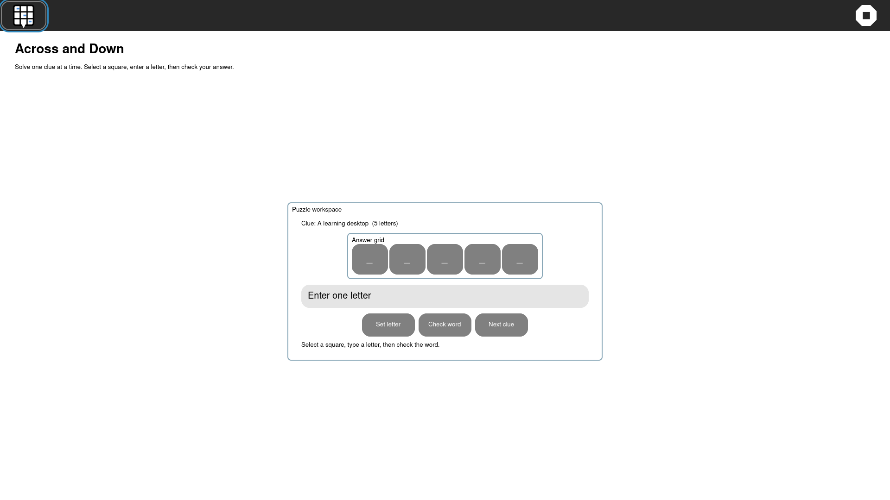

# Across and Down GTK4 UX pass — 2026-10-04

The visual sweep showed the answer grid detached from a full-width letter
entry, leaving the Activity read like unrelated controls rather than one
crossword task.

The workspace now presents:

- a short instruction subtitle;
- one centered `Puzzle workspace` card containing the clue, answer grid,
  single-letter entry, actions, and status;
- bounded responsive sizing rather than a monitor-wide entry bar;
- accessible labels for the input, actions, and puzzle status.

The crossword state model and JSON Journal payload are unchanged.

Host verification:

```text
pytest -q tests/test_gtk4_acrossdown_activity.py
1 passed
```

The rebuilt development preview also passed the focused guest visual sweep:

```text
visual-sweep=COMPLETE pass=1 fail=0 resolution=1920x1080
```



This improves the GTK4 forward path but does not change GTK3 retirement
classification yet.
