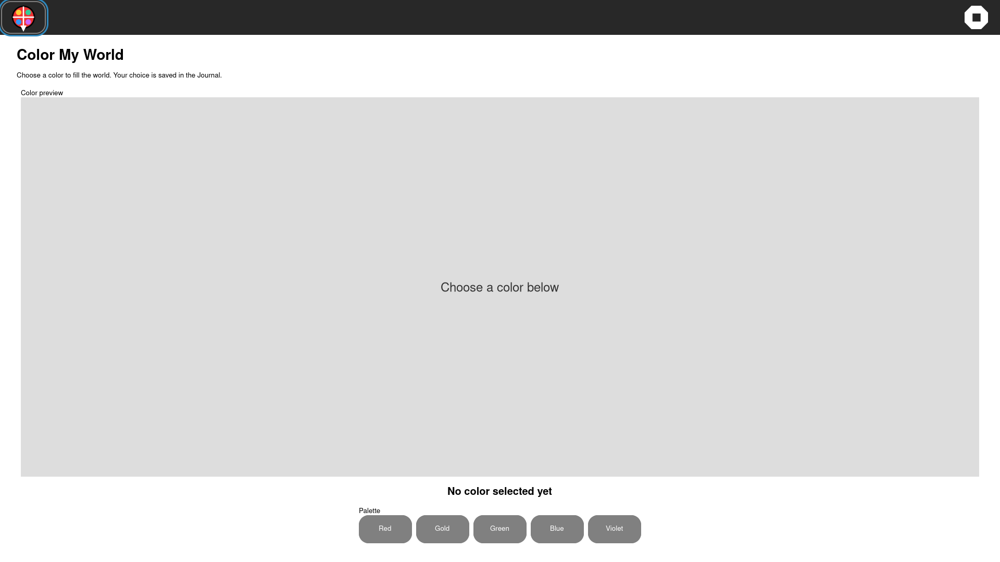

# Color My World GTK4 UX pass — 2026-10-04

The source pass closes the main visual and interaction gap seen in the
packaged sweep: an unexplained full-bleed empty canvas with small palette
actions.

Changes:

- added an instruction subtitle and an explicit `No color selected yet`
  empty state;
- changed palette actions to GTK4 toggle controls with visible selected-state
  styling, so the current color remains obvious after activation;
- added accessible labels and descriptions for every color action and the
  selection status;
- kept the existing JSON Journal payload and made invalid/empty restores clear
  any stale selection.

Verification:

```text
pytest -q tests/test_gtk4_colormyworld_activity.py
2 passed
```

The rebuilt development preview also passed one real guest Journal lifecycle
and visual capture at 1920×1080:

```text
cycle=1 ... resume=PASS service-release=PASS shell-cleanup=PASS
colormyworld-roundtrip=PASS input-method=AT-SPI datastore-payload=seeded
visual-sweep=COMPLETE pass=1 fail=0 resolution=1920x1080
```



This is a bounded Activity qualification, not a GTK3 retirement claim; full
artwork and collaboration parity remain open.
