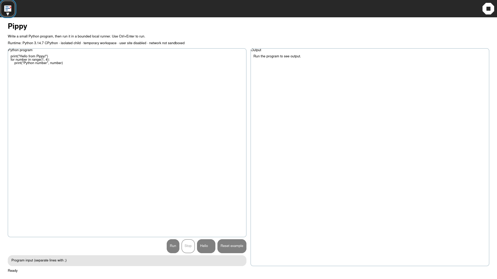

# GTK4 Pippy runtime-contract UX receipt

Date: 2026-10-04

The rebuilt development guest shows the Python runtime boundary directly
above the editor: Python version/implementation, isolated child mode,
temporary workspace, disabled user site, and the explicit non-sandboxed
network policy. This keeps the Activity useful for teaching without implying
security isolation that the runner does not provide.

Focused guest visual sweep:

```text
visual-sweep=COMPLETE pass=1 fail=0 resolution=1920x1080
```



The companion runtime probe passed output, error, wall-clock timeout,
cancellation, isolated-runner, and runtime-contract checks.
