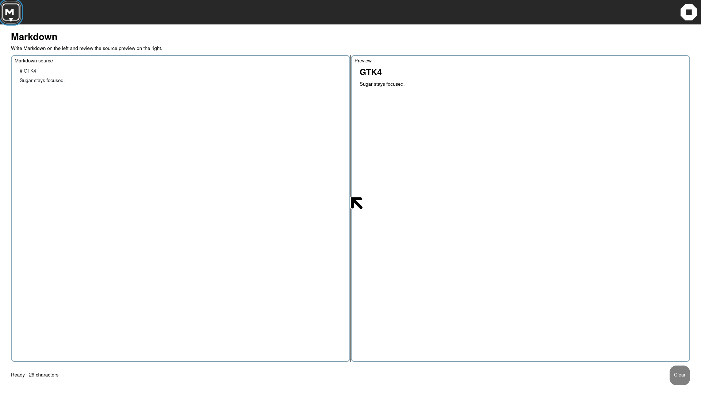
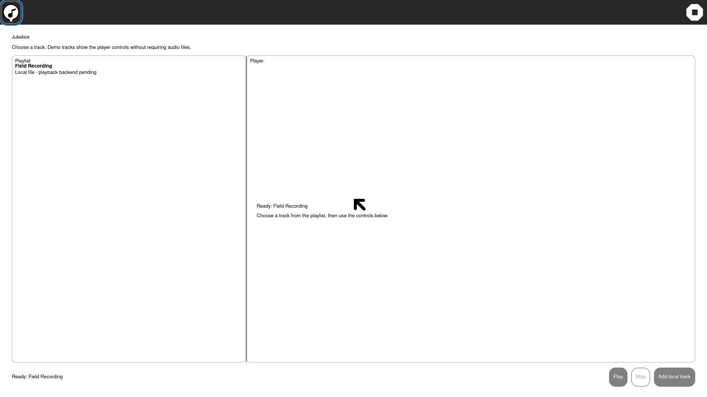

# GTK4 activity pane allocation pass — 2026-10-05

The packaged visual sweep showed Markdown and Jukebox rendering only the left
side of their intended two-surface workspaces. Their source used homogeneous
`Gtk.Grid` columns, but the capture did not provide a visible editor/preview or
playlist/player split at the guest boundary.

Both activities now use an explicit horizontal `Gtk.Paned` with non-shrinking
start and end children, resize participation on both sides, and a wide
divider handle. This makes the two work surfaces part of the actual GTK4
allocation contract instead of relying on the grid's preferred-size result.

The Markdown correction is now qualified in the development guest with a real
Journal resume and AT-SPI-visible capture:

```text
cycle=1 ... resume=PASS service-release=PASS shell-cleanup=PASS
markdown-roundtrip=PASS input-method=AT-SPI datastore-payload=seeded
```



The Jukebox roundtrip has also passed the same lifecycle boundary. Its
resumed capture shows the Playlist and Player surfaces allocated side by side:

```text
cycle=1 ... resume=PASS service-release=PASS shell-cleanup=PASS
jukebox-roundtrip=PASS input-method=AT-SPI datastore-payload=seeded
```



These are development-guest captures from the synchronized share, not a new
standalone ISO qualification. The older packaged capture remains the reason
for the change, not proof of the fix.
