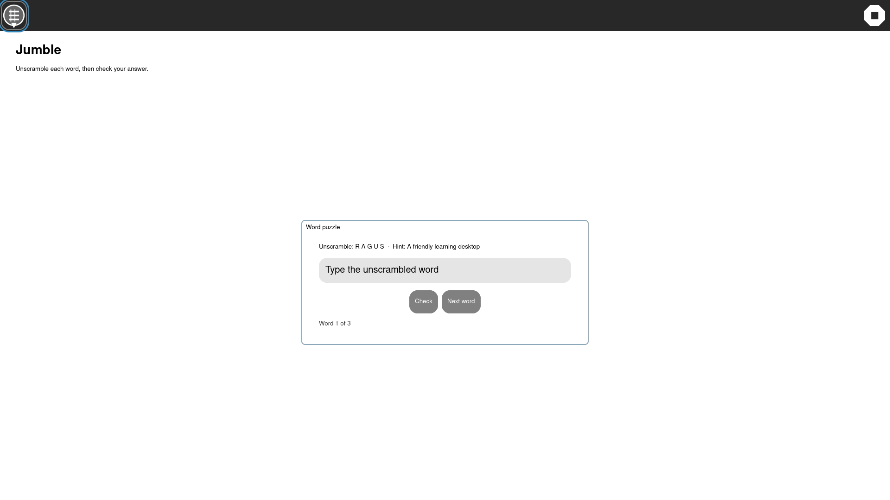
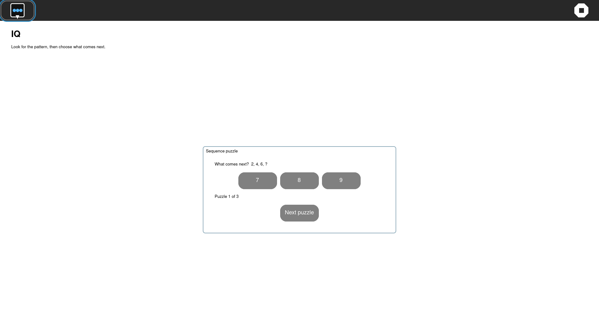
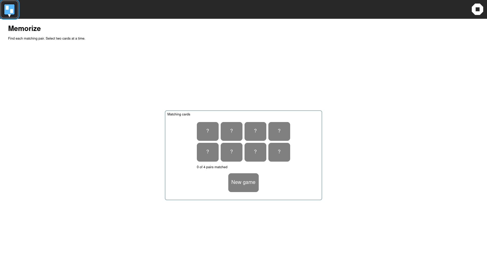

# GTK4 puzzle workspace UX pass — 2026-10-04

Jumble, IQ, and Memorize shared the same sweep defect: the task controls were
spread across a full-width Activity surface, making each one read like a
small collection of unrelated calculator controls.

The three Activities now use a bounded centered workspace card. Each card
keeps its existing state model and Journal payload while grouping the task
prompt, input or choices, status, and next/reset actions. Instructions and
accessible status/action labels were added where they were missing.

Host verification:

```text
pytest -q tests/test_gtk4_jumble_activity.py tests/test_gtk4_iq_activity.py tests/test_gtk4_memorize_activity.py
3 passed
```

The rebuilt development preview passed the combined guest visual sweep:

```text
visual-sweep=COMPLETE pass=3 fail=0 resolution=1920x1080
```







No GTK3 retirement claim is changed by this bounded UX qualification.
